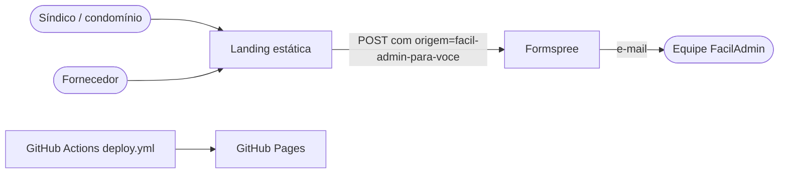

# Arquitetura — FacilAdmin Para Você

## 1. Visão C4



## 2. Estrutura

```
index.html        dobras da página (hero, categorias, personas, ofertas, pacotes, destaques, galeria, prova social, como funciona, contato)
style.css         design system + bloco "ciclo MVP" (acessibilidade, contraste, estados)
script.js         menu, rolagem, pacotes → orçamento, listas de destaque, formulário
assets/*.webp     (novo) imagens otimizadas
deploy.yml        workflow de publicação (precisa ir para .github/workflows/)
docs/             análise, arquitetura e plano
```

## 3. Modelo do lead (contrato com o Formspree)

| Campo | Origem | Regra |
|---|---|---|
| `name` | formulário | ≥ 3 caracteres |
| `phone` | formulário | ≥ 10 dígitos |
| `email` | formulário | formato de e-mail |
| `profile_type` | formulário | `condominio` ou `fornecedor` |
| `message` | formulário ou botão do pacote | "Quero orçamento de: {pacote} — {métrica}, quantidade {n}." |
| `origem` | oculto | `facil-admin-para-voce` |
| `_subject` | oculto | assunto do e-mail no Formspree |
| `_gotcha` | oculto | honeypot anti-spam |

## 4. Decisões (ADR)

### ADR-001 — Pacote vira pedido estruturado

- **Decisão:** o botão "Solicitar Orçamento" escreve pacote, métrica e quantidade na mensagem e seleciona o perfil "condomínio".
- **Consequência:** menos digitação para o síndico e um dado mensurável de demanda por pacote (sinal de validação do marketplace).

### ADR-002 — Setas das listas giram a lista

- **Decisão:** mover o primeiro item para o fim (e vice-versa) com `aria-live`.
- **Consequência:** controles passam a fazer o que prometem sem biblioteca de carrossel.

### ADR-003 — Cor secundária escurecida

- **Decisão:** `--secondary-color` de `#059669` para `#047857`; laranja das ofertas para `#b93d00`.
- **Consequência:** contraste AA preservando a identidade (verde esmeralda e laranja de oferta).

### ADR-004 — Conteúdo comercial não alterado

- **Decisão:** preços, selos, estrelas e depoimentos ficaram como estavam.
- **Consequência:** a decisão de rotular como "exemplo"/"simulação" ou trocar por dados reais é sua (ver pendências).
